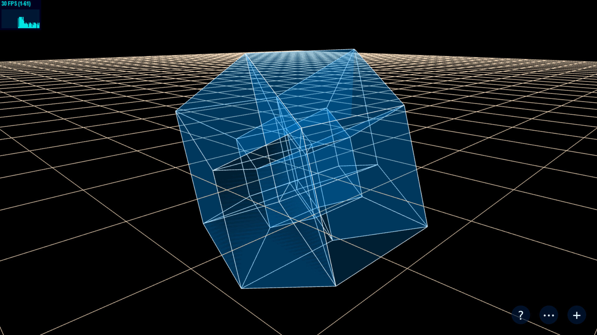

# Visualization-of-Hyper-Geometries

[Play with it](https://sdtelectronics.github.io/Visualization-of-Hyper-Geometries/src/index.html?Demo2)

The entry above comes with a 5D hyperCube with rotation animation.

Explore details in the [Wiki](https://github.com/SdtElectronic/Visualization-of-Hyper-Geometries/wiki/Classes-Reference)